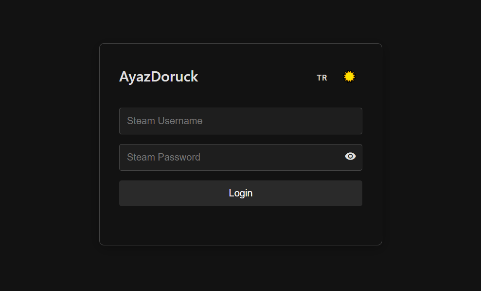
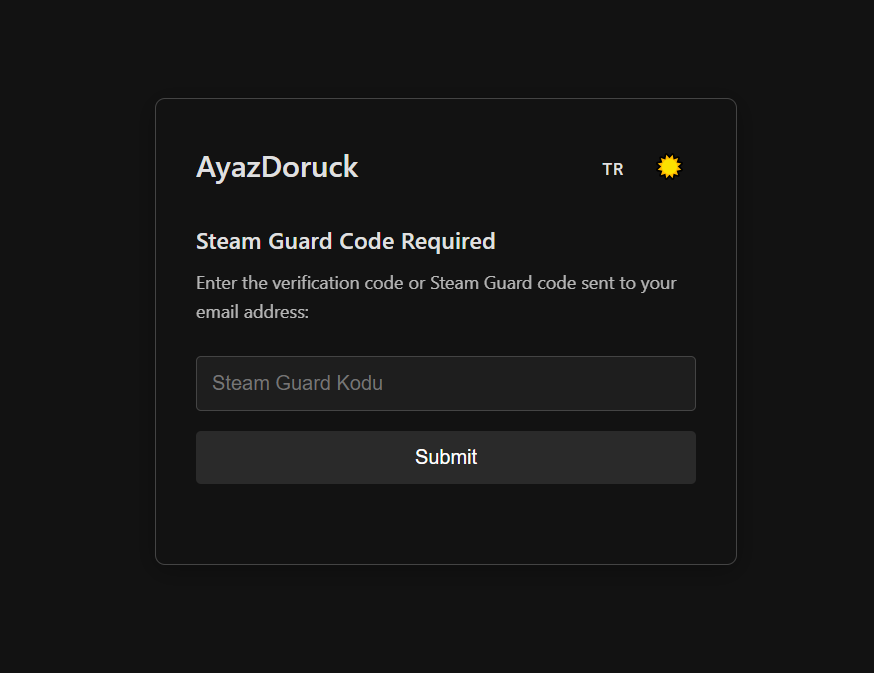
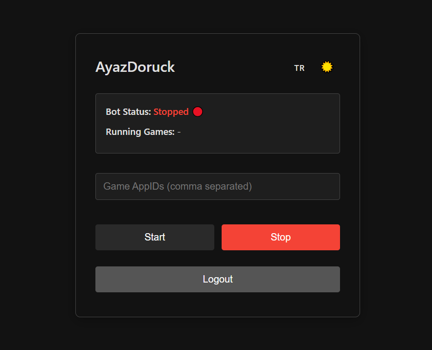

# Steam Hour Bot 🤖

This project is a Node.js-based bot that allows you to accumulate hours on your Steam account by appearing online in specific games. Through a user-friendly web interface, you can log into your Steam account, select games, and start idling hours. It offers both Turkish and English language support, along with dark/light theme options.

---

## Features ✨

* **Easy Steam Account Login:** Supports username, password, and Steam Guard codes.
* **Multi-Game Idling:** Idle hours in multiple games simultaneously.
* **Real-time Bot Status Tracking:** Monitor the bot's live status via WebSocket.
* **Turkish and English Language Support:** Use the interface in your preferred language.
* **Dark and Light Theme Options:** Choose between a dark or light interface for comfort.
* **Simple and Mobile-Friendly Web Interface:** Easily accessible design from any device.

---

## Requirements 🛠️

To run this project, you need the following installed on your system:

* **Node.js** (v14 or higher recommended)
* **Internet Connection**

---
## ❗ IMPORTANT ❗


* **You can log in to only one account at a time.**
* **In case of any ban, you are responsible.**
* **As long as you give credit, you can edit the project as you wish and share it publicly.**


---

## Setup 🚀

Follow these steps to set up and run the project on your local machine:

1.  **Clone or Download the Repository:**
    ```bash
    git clone https://github.com/ayazdoruck/steam-hour-bot.git
    ```
2.  **Open Project Directory:**
    ```bash
    cd steam-hour-bot
    ```

3.  **Install Necessary Dependencies:**
    ```bash
    npm install
    ```

4.  **Start the Bot:**
    ```bash
    npm start
    ```

5.  **To Run in Development Mode (with automatic restart):**
    ```bash
    npm run dev
    ```

---

## Usage 🎮

1.  After starting the bot, navigate to **http://localhost:3443** in your web browser.
2.  In the **Login** section, enter your Steam username and password, then click the "Login" button.
3.  If Steam Guard is enabled, enter the code you receive via email or your mobile app into the **Steam Guard Code** field.
4.  Once logged in, enter the AppIDs of the games you wish to idle (e.g., **730** for CS:GO, **440** for Team Fortress 2) into the relevant field, separated by commas (e.g., `730,440`).
5.  Click the **Start** button. The bot will begin appearing online in the selected games.
6.  You can monitor the bot's status and the games being played from the interface.
7.  To stop the bot, click the **Stop** button. To fully log out of your Steam account, click the **Logout** button.
8.  You can change the language (Turkish/English) and theme (Dark/Light) options from the top-right menu.

---
## Get in Touch or Donate me 📧

* **Buy me a Coffee:** [coff.ee/pahiy](https://coff.ee/pahiy)
* **Instagram:** [@ayazdoruck](https://www.instagram.com/ayazdoruck/)

---
## Screenshots 📸

<div style="display:flex; flex-wrap:wrap; justify-content:center; gap:10px;">
    
    
    
</div>
