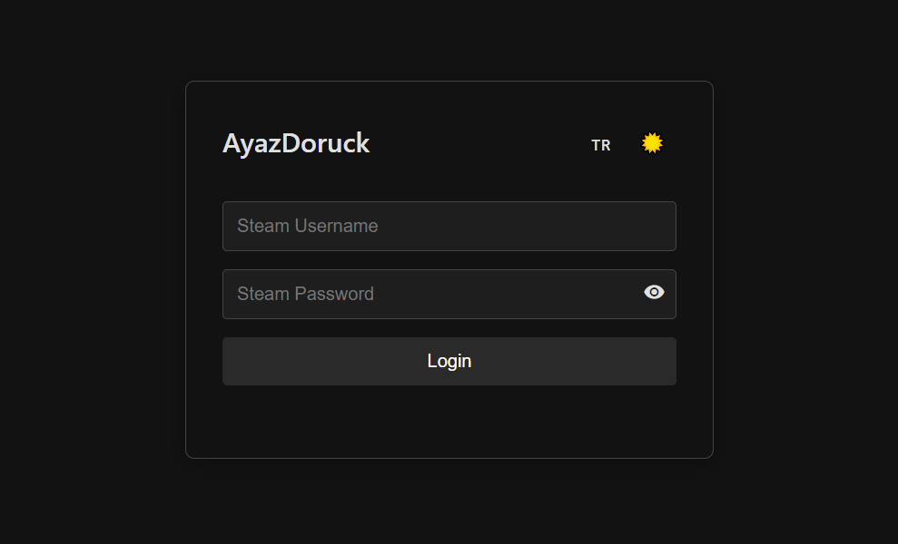
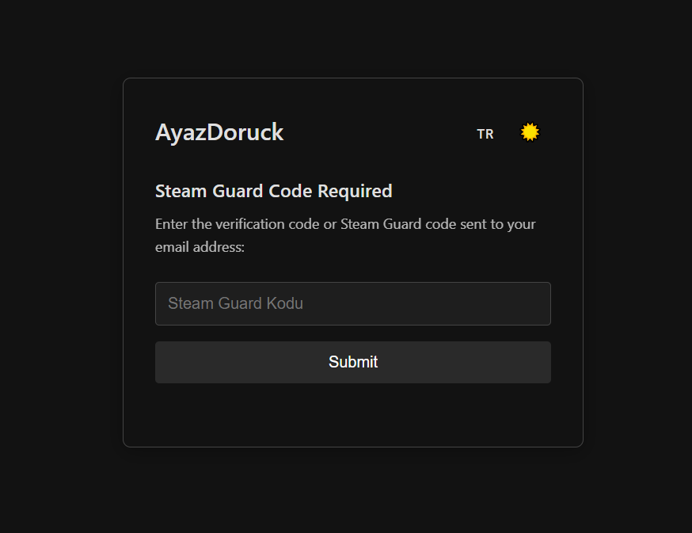
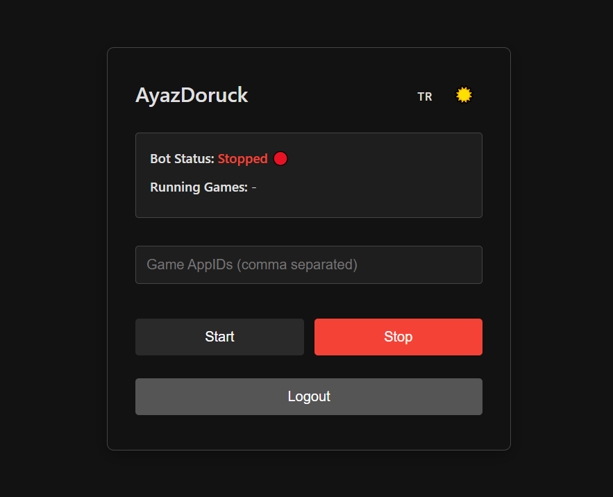

# Steam Hour Bot 🤖

This project is a Node.js-based bot that allows you to accumulate hours on your Steam account by appearing online in specific games. Through a user-friendly web interface, you can log into your Steam account, select games, and start idling hours. It offers both Turkish and English language support, along with dark/light theme options.

---

## Features ✨

* **Easy Steam Account Login:** Supports username, password, and Steam Guard codes.
* **Multi-Game Idling:** Idle hours in multiple games simultaneously (up to 32 at once).
* **Game Names:** Idled games are shown with their real Steam names, not just AppIDs.
* **Persistent AppID Memory:** The last games you idled are remembered per account and auto-filled the next time you log in.
* **Session & Total Playtime Tracking:** See a live timer for the current session plus your all-time accumulated idle time.
* **Automatic Reconnect:** If the connection to Steam drops, the bot reconnects and resumes idling automatically using a saved refresh token — no password re-entry needed.
* **Real-time Bot Status Tracking:** Monitor the bot's live status via WebSocket, from any number of open browser tabs.
* **Turkish and English Language Support:** Use the interface in your preferred language.
* **Dark and Light Theme Options:** Choose between a dark or light interface for comfort.
* **Simple and Mobile-Friendly Web Interface:** Easily accessible design from any device.
* **Optional Access Protection:** Lock the control panel behind a username/password and/or serve it over HTTPS/WSS when exposed beyond localhost.

---

## Requirements 🛠️

To run this project, you need the following installed on your system:

* **Node.js v18 or higher** (v20+ recommended)
* **Internet Connection**

---
## ❗ IMPORTANT ❗


* **You can log in to only one account at a time.**
* **In case of any ban, you are responsible.**
* **As long as you give credit, you can edit the project as you wish and share it publicly.**


---

## Setup 🚀

Follow these steps to set up and run the project on your local machine:

1.  **Clone or Download the Repository:**
    ```bash
    git clone https://github.com/ayazdoruck/steam-hour-bot.git
    ```
2.  **Open Project Directory:**
    ```bash
    cd steam-hour-bot
    ```

3.  **Install Necessary Dependencies:**
    ```bash
    npm install
    ```

4.  **Start the Bot:**
    ```bash
    npm start
    ```

5.  **To Run in Development Mode (with automatic restart):**
    ```bash
    npm run dev
    ```

6.  **To Run the Test Suite:**
    ```bash
    npm test
    ```

---

## Usage 🎮

1.  After starting the bot, navigate to **http://localhost:3443** in your web browser.
2.  In the **Login** section, enter your Steam username and password, then click the "Login" button.
3.  If Steam Guard is enabled, enter the code you receive via email or your mobile app into the **Steam Guard Code** field.
4.  Once logged in, enter the AppIDs of the games you wish to idle (e.g., **730** for Counter-Strike 2, **440** for Team Fortress 2) into the relevant field, separated by commas (e.g., `730,440`). If you idled games before, this field is pre-filled automatically.
5.  Click the **Start** button. The bot will begin appearing online in the selected games, and the game names, session timer, and total accumulated time will be shown.
6.  You can monitor the bot's status and the games being played from the interface, from any open tab.
7.  To stop the bot, click the **Stop** button. To fully log out of your Steam account, click the **Logout** button.
8.  You can change the language (Turkish/English) and theme (Dark/Light) options from the top-right menu.
9.  If your connection to Steam drops (network blip, laptop sleep, etc.), the bot reconnects and resumes idling on its own — you don't need to log back in.

---

## Configuration (optional) ⚙️

All configuration is done through environment variables — none are required for local/personal use on `localhost`.

| Variable | Purpose |
|---|---|
| `PORT` | Port to listen on. Defaults to `3443`. |
| `APP_USERNAME` / `APP_PASSWORD` | If **both** are set, the control panel (web UI and WebSocket) is protected with HTTP Basic Auth. Strongly recommended if you deploy this somewhere reachable beyond your own machine. |
| `SSL_KEY_PATH` / `SSL_CERT_PATH` | If **both** are set, the server runs over HTTPS/WSS instead of plain HTTP/WS using the given key/certificate files. |

Example (PowerShell):
```powershell
$env:APP_USERNAME="admin"
$env:APP_PASSWORD="a-strong-password"
npm start
```

---

## Data & Security Notes 🔒

* Your Steam session is kept alive using a **refresh token**, not your password — the password is only sent once, at login, and is never written to disk.
* Refresh tokens, remembered AppIDs, and accumulated playtime are stored locally in the `data/` folder as plain JSON files. This folder is git-ignored and never committed.
* If you expose this bot beyond `localhost` (e.g. on a VPS), set `APP_USERNAME`/`APP_PASSWORD` and, ideally, `SSL_KEY_PATH`/`SSL_CERT_PATH` — otherwise anyone who can reach the port can control your Steam account.

---

## Architecture 🧩

* `index.js` — Express + WebSocket server, wires browser messages to the Steam client and broadcasts status to all connected tabs.
* `steamClient.js` — the single, persistent `steam-user` session: login/logout, Steam Guard, automatic reconnect, and farming state.
* `sessionStore.js`, `appidStore.js`, `playtimeStore.js`, `gameNameStore.js` — small JSON-file-backed stores (via the shared `fileStore.js` helper) for refresh tokens, remembered AppIDs, accumulated playtime, and cached game names.
* `public/` — the vanilla HTML/CSS/JS control panel (no build step, no frontend framework).
* `test/` — `node:test` unit tests for the data stores.

---
## Get in Touch or Donate me 📧

* **☕ Buy me a Cofe:** [coff.ee/pahiy](https://coff.ee/pahiy)
* **🅾 Instagram:** [@ayazdoruck](https://www.instagram.com/ayazdoruck/)

---
## Screenshots 📸

<div style="display:flex; flex-wrap:wrap; justify-content:center; gap:10px;">
    
    
    
</div>
